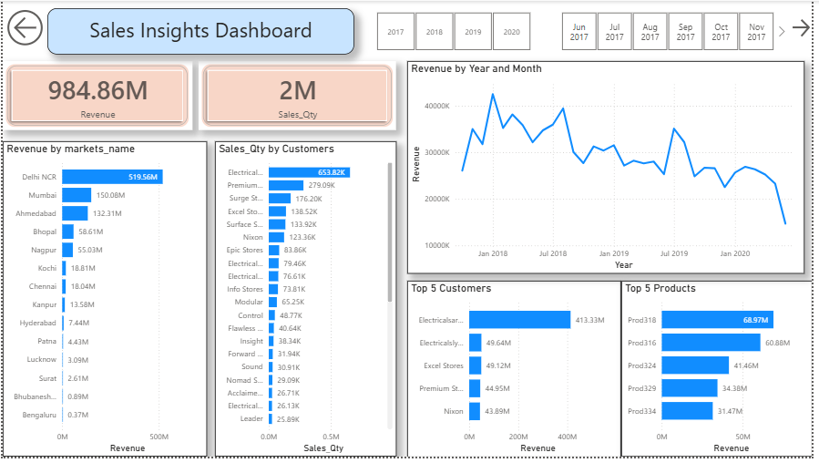
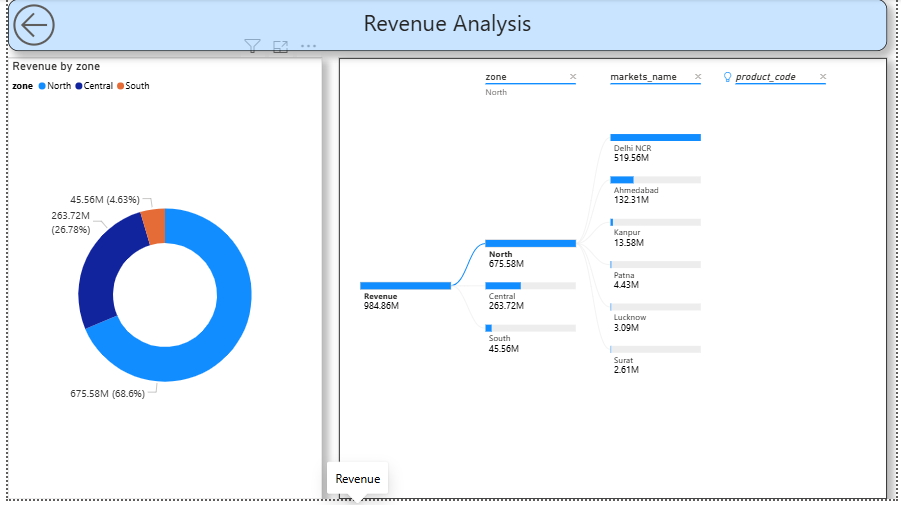

# Sales Insights Dashboard | Power BI
Interactive Sales Insights Dashboard built using Power BI, MySQL, Power Query, and DAX to analyze revenue, sales quantity, top customers, top products, and market performance.

## Project Overview

This project analyzes sales performance across multiple markets, customers, and products using Power BI. The objective is to transform raw sales data into meaningful business insights through interactive dashboards and visualizations.

The dashboard enables stakeholders to monitor revenue trends, identify top-performing markets and customers, evaluate product performance, and support data-driven decision-making.

---

## Problem Statement

The organization lacked a centralized reporting system to monitor sales performance effectively. Business users relied on manual reports and spreadsheets, making it difficult to identify trends and make timely decisions.

The goal of this project was to build an interactive Power BI dashboard that provides a clear view of sales performance and key business metrics.

---

## Tools & Technologies

* Power BI Desktop
* Power Query
* DAX (Data Analysis Expressions)
* Data Modeling
* MySQL

---

## Data Preparation

* Connected Power BI to source data
* Performed data cleaning and transformation using Power Query
* Built relationships between tables
* Created DAX measures for business KPIs

---

## Key Metrics

* Total Revenue
* Total Sales Quantity
* Revenue by Market
* Revenue Trend Analysis
* Top Customers
* Top Products
* Revenue by Zone

---

## Dashboard Pages

### 1. Executive Dashboard

* Revenue KPI Cards
* Sales Quantity KPI Cards
* Revenue Trend Analysis
* Revenue by Market
* Top 5 Customers
* Top 5 Products

### 2. Revenue Analysis

* Revenue by Zone
* Decomposition Tree
* Drill-down Analysis
* Product-wise Revenue Breakdown

---

## Business Insights

* In this dashboard, we can see company has generated total revenue in 4 years ₹ 985M, Sales Qty ₹2M.
* In 2020 company has generated total revenue of ₹ 142M by selling a total of 350K.
* Delhi NCR is the highest revenue-generating market.
* North Zone contributes the largest share of total revenue.
* A small group of customers contributes a significant portion of total sales.
* Product performance varies significantly across markets.
* Revenue trends reveal seasonal fluctuations and business opportunities.

---

## Data Analysis using MySQL

* Imported sales data into MySQL Workbench.
* Performed exploratory data analysis using SQL queries.
* Identified data quality issues and validated business data.
* Extracted insights from customers, products, and sales transactions.

---

## Data Cleaning & ETL

### Database Connection
* Connected Power BI Desktop to the MySQL database.

### Data Loading
* Imported sales-related tables into Power BI for analysis.

### Data Transformation
* Cleaned and transformed raw data using Power Query.
* Handled inconsistencies and prepared data for modeling and reporting.

### Data Modeling
* Created relationships between tables and developed DAX measures for KPI analysis.

---

## Dashboard Screenshots

### Executive Dashboard

### Revenue Analysis

---

## Skills Demonstrated

* Data Cleaning
* Power Query
* Data Modeling
* DAX Measures
* SQL Analysis
* KPI Development
* Dashboard Design
* Business Intelligence
* Data Visualization

---

## Author

Srushti

Aspiring Data Analyst | Power BI | SQL | Data Science
